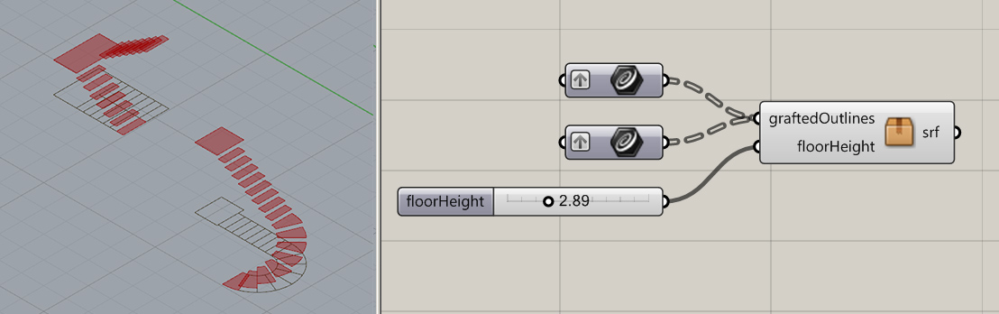

## GettingArchitectureDoneKit

Just-add-water functions in Grasshopper for Rhino to perform frequent design and architecture tasks.

This library is part of the [Getting Architecture Done](http://www.gettingarchitecturedone.com/?utm_source=github&utm_medium=GADKit) project. Follow [@GettingArchDone](http://twitter.com/GettingArchDone) on Twitter or [Facebook](http://facebook.com/gettingarchitecturedone) to keep updated.

## Usage

Just download *GettingArchitectureDoneKit.gh* and drag it onto Grasshopper. There are various clusters to simplify frequent tasks.

Currently, the documentation is incomplete, and the Grasshopper library contains more functions than is written below. An update with a cleanup of documentation and library will arrive soon.

Also, the Inbox folder now contains separated nodes that will be incorporated to the library in the near future.

## Nodes

### LIST: Remove List Extremes

Remove elements from beginning or end of a list with integers.

### CRV: Line With Center, Direction, Length

Create a line with its middle point as a parameter.

### CRV: Thicken With Offset Thickness

Create an outline from a line with a given thickness.

### SRF: Solid With Outline, Base Z, Height

Create a solid with the plan drawing outline, as a extrusion from a *Z* distance with a given *Height.*

### PEOPLE: Populate Surface With Amount, Angle

Add human scale to a surface with a certain number of people and a rotation angle. It returns the outlines as planar curves which can be used to create a planar surface via *Boundary Surfaces,* and it gets a *seed* value to re-randomize the locations.

### SRF: Ondulated Panel With Curve, DivisionLength, Thickness, Height

A constructive panel for facades and interior spaces which can be ondulated, created from a base Curve. Panels take a Thickness and a DivisionLength parameter to customize the ondulation of the panels. The Height is also variable.

## Inbox Folder

### Util_StairsFromPlanSteps

Create flat stairs with plan steps referenced from a 2D drawing and a height. Multiple stairs can be created at a time sharing a given height.

## TODO

This library is moving into a different structure. Rather than having a single file with all the clusters, each function will have independent files, with proper prefixes so the library can be browsed with ease just by looking into the file names. In that way, the library will work as a set of helper functions which will be versioned independently.

What follows is a list with proposed functions that are to be developed [or are already developed in some way in the current library]. Anyone is free to developed any of the parts, propose new ones, and re-factor existing ones.

* GADGeometryColorGradient
* GADGeometryExtrudeFromCenter
* GADGeometrySortByNeighbours
* GADCurveFromCenter
* GADCurveSubCurveWithPoints
* GADPointOnPlane
* GADPeopleMaker

## License

GettingArchitectureDoneKit is licensed under the MIT license. (http://opensource.org/licenses/MIT)

## Me

I tweet at [@nonoesp](http://www.twitter.com/nonoesp) and blog at [nono.ma/says](http://nono.ma/says). I would love to hear about it if you use this library. Thanks!
